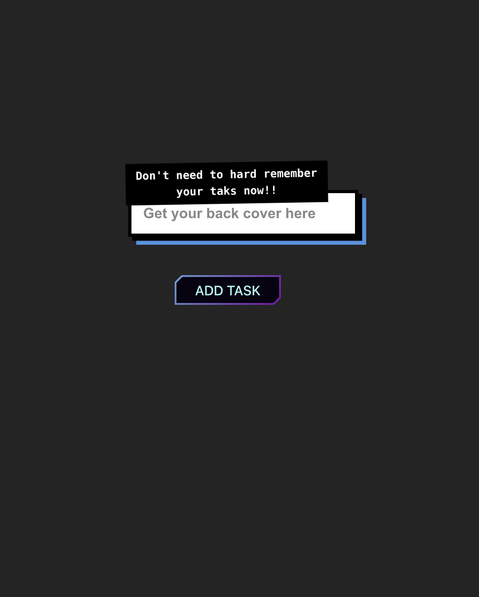

# week2laserants
## This is the todo list 

This project is a simple To-Do List application built using TypeScript and vanilla JavaScript, with basic HTML and CSS for structure and styling. The app allows users to:

Add tasks to a list.
Delete tasks from the list.
Mark tasks as completed by disabling the delete button and underlining the text.
The purpose of this app is to demonstrate dynamic DOM manipulation, event handling, and basic interactivity using vanilla JavaScript/TypeScript.


- File Structure:
Ensure you have the following file structure:
```
/project-root
├── index.html
├── index.css
└── src
    └── main.ts
```
this is the input field 


this is the taks when is created


this is the task when is completed


this is the full app


In order to get the logic application please look into src/main.ts

## Features
- Add Task: Allows users to add a new task to the list by typing in the input field and clicking the "Add Task" button.
- Delete Task: Each task has a delete button to remove it from the list.
- Mark Task as Completed: Each task has a disable button that, when clicked, disables the delete button and underlines the task text to indicate completion.